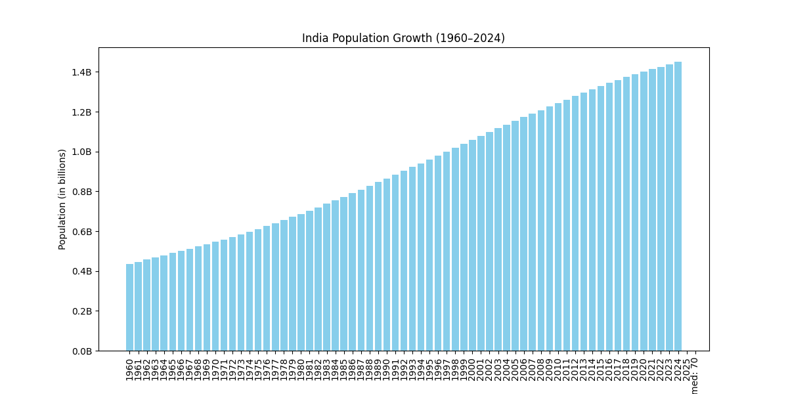

# SCT_DS_1
Skill Craft Task 01 — Visualizing India’s Population Growth with Python

## Task 01: India Population Visualization
This project is part of my Skill Craft Data Science internship.

### 📌 Overview
This project is part of my Skill Craft Data Science internship.  
It focuses on visualizing India’s population growth and distribution using Python, pandas, and matplotlib.  
The dataset is sourced from the World Bank (World Development Indicators).

### 🛠️ Tools Used
- Python
- pandas
- matplotlib
- GitHub (for version control and sharing)

### 📂 Files in Repository
- `india_population_data.csv` → Cleaned dataset containing population data.  
- `task01_india_population.py` → Python script for data processing and visualization.  
- `README.md` → Project documentation.  
- `india_population_chart.png` → Output chart showing India’s population growth.

### 📊 Steps Performed
1. Loaded the dataset using pandas.  
2. Removed metadata rows to clean the CSV file.  
3. Filtered India’s population data from 1960–2024.  
4. Created bar charts to visualize population growth and distribution by age groups.  
5. Saved and uploaded the visualization to GitHub.

### 📈 Output Plots
Here is an example of India’s population distribution by age in 2022:

- **0–20 Years:** 512 Mn (36.1%)  
- **21–64 Years:** 807 Mn (57.0%)  
- **65+ Years:** 98 Mn (6.9%)

*Figure: India’s population growth from 1960–2024.*

### 🎯 Learning Outcome
- Cleaned and prepared real-world datasets.  
- Practiced data visualization with matplotlib.  
- Learned how to present results professionally on GitHub.  
- Gained confidence in combining code, data, and documentation for a complete project.
